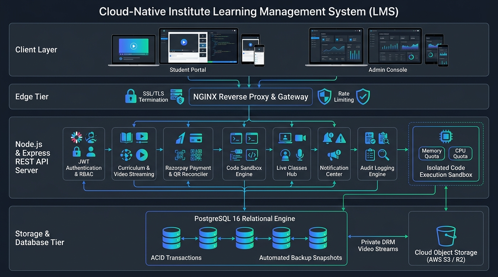
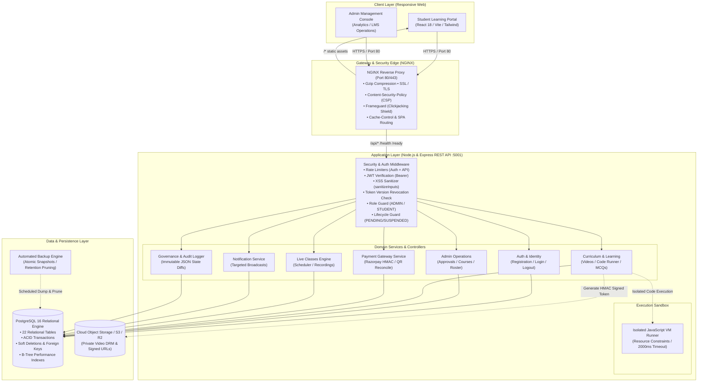
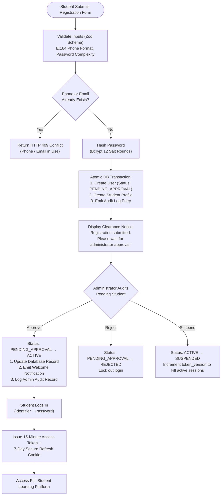
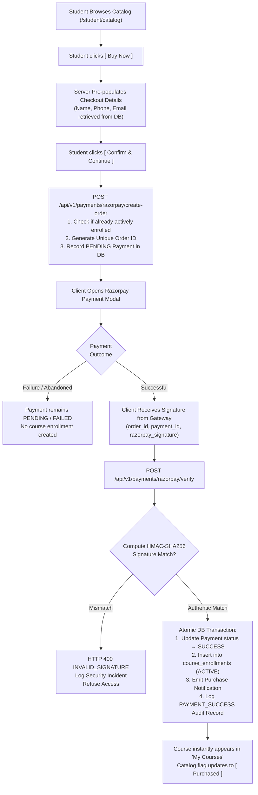
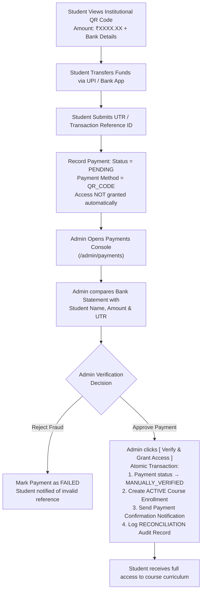
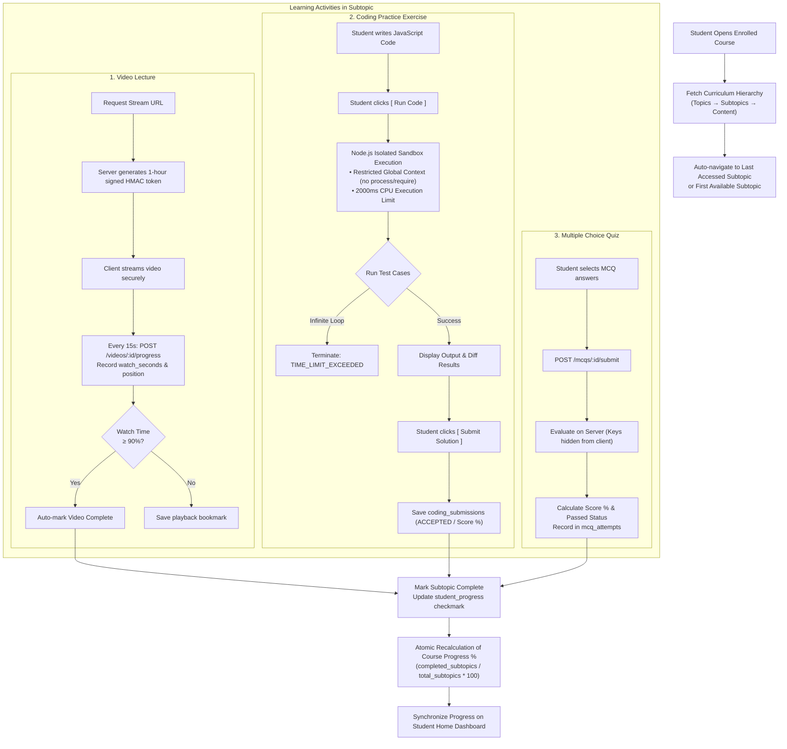
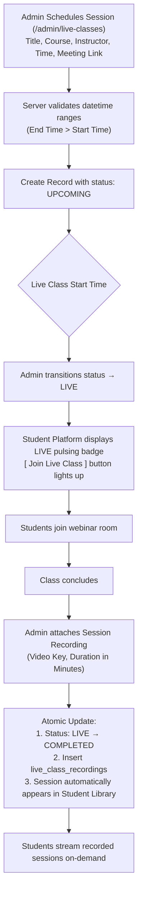
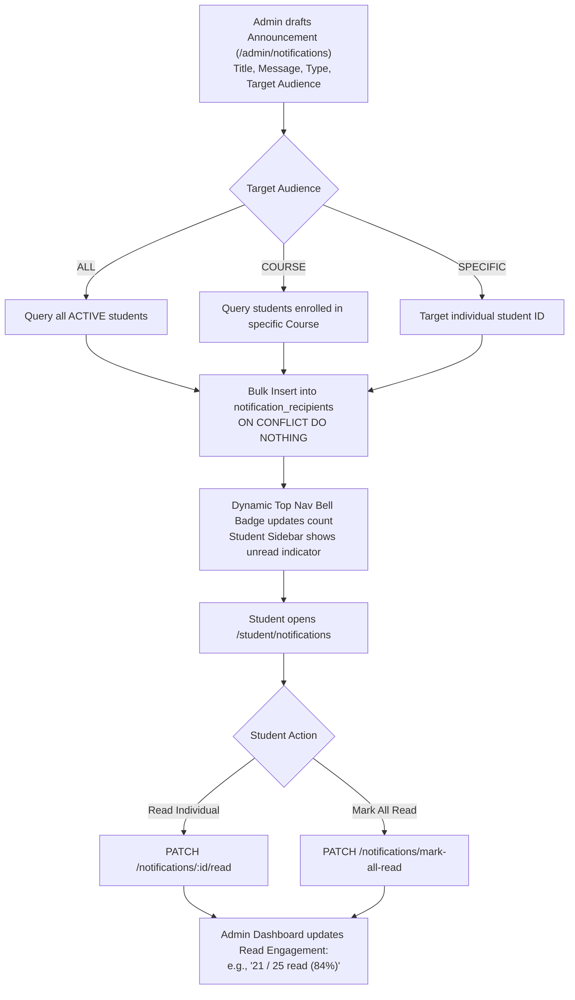
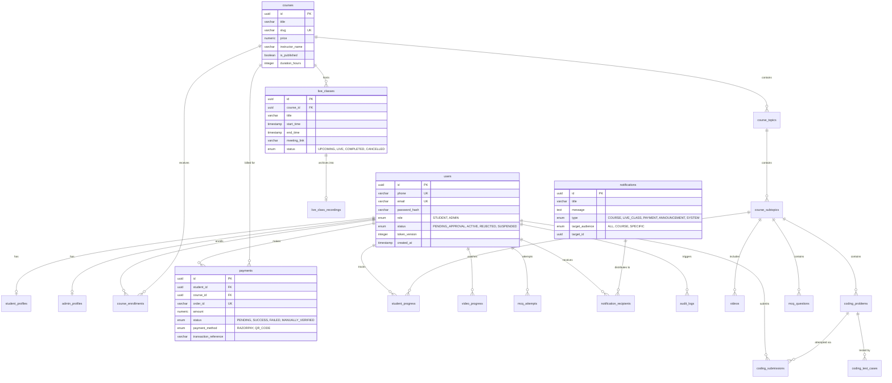
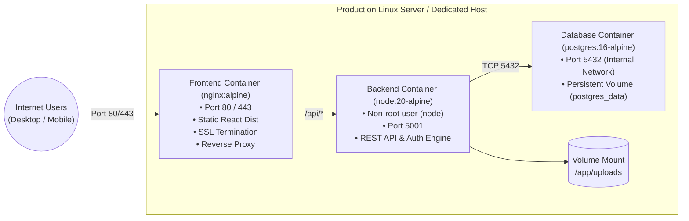

# Apex Institute Learning Management Platform (LMS)

[](.)
[](.)
[](.)
[](.)
[](.)
[](.)

A high-performance, secure, and production-grade web-based Learning Management System designed for educational institutions. The platform delivers dual interfaces: an interactive **Student Learning Portal** and a comprehensive **Institutional Administration Console**, backed by an enterprise relational database with ACID guarantees, multi-layer security hardening, automated disaster-recovery backups, and real-time operational telemetry.

---

## Table of Contents
1. [System Architecture Overview](#1-system-architecture-overview)
2. [End-to-End Operational Flowcharts](#2-end-to-end-operational-flowcharts)
   - [A. Student Registration & Administrative Clearance](#a-student-registration--administrative-clearance)
   - [B. Course Purchase & Payment Verification (Razorpay)](#b-course-purchase--payment-verification-razorpay)
   - [C. Institutional QR Payment & Manual Reconciliation](#c-institutional-qr-payment--manual-reconciliation)
   - [D. Course Learning, Sandboxed Execution & Assessments](#d-course-learning-sandboxed-execution--assessments)
   - [E. Live Classes & Recorded Masterclass Sessions](#e-live-classes--recorded-masterclass-sessions)
   - [F. Institutional Notification & Broadcast Engine](#f-institutional-notification--broadcast-engine)
3. [Database Architecture & Entity Relationships](#3-database-architecture--entity-relationships)
4. [Security & Governance Architecture](#4-security--governance-architecture)
5. [Production Deployment Architecture](#5-production-deployment-architecture)
6. [Quick Start & Setup Guide](#6-quick-start--setup-guide)
7. [Default Seed Credentials](#7-default-seed-credentials)
8. [Automated Verification & Test Suite](#8-automated-verification--test-suite)

---

## 1. System Architecture Overview



The platform is designed around a multi-tier, decoupled architecture with strict layer isolation:



---

## 2. End-to-End Operational Flowcharts

### A. Student Registration & Administrative Clearance
Students cannot access courses or dashboard until an institution administrator explicitly audits and clears their account.



---

### B. Course Purchase & Payment Verification (Razorpay)
Ensures zero race conditions and cryptographic signature verification on the server before granting course enrollments.



---

### C. Institutional QR Payment & Manual Reconciliation
Provides offline bank transfer and UPI QR options without automated blind trust.



---

### D. Course Learning, Sandboxed Execution & Assessments
Dedicated student player with automated progress tracking and sandboxed code execution.



---

### E. Live Classes & Recorded Masterclass Sessions
Interactive live class operations with live status controller and archive library.



---

### F. Institutional Notification & Broadcast Engine
Broadcasts announcements to targeted audiences with engagement analytics.



---

## 3. Database Architecture & Entity Relationships

The data layer uses PostgreSQL 16 with UUID primary keys, strict foreign keys, and cascading relationships:



---

## 4. Security & Governance Architecture

1. **Server-Enforced Access Control (RBAC)**:
   - Client-side navigation guards are strictly mirrored and enforced on every API route via `authenticateToken`, `requireActive`, and `requireRole(['ADMIN'] | ['STUDENT'])`.
   - Accounts marked `PENDING_APPROVAL`, `REJECTED`, or `SUSPENDED` are rejected at the middleware boundary with HTTP 403.
2. **Instant Session Invalidation**:
   - Administrative suspension increments the user's `token_version` in the database, invalidating all existing JWTs across all active devices immediately.
3. **Input Sanitization & XSS Mitigation**:
   - The recursive `sanitizeInputs` middleware scrubs `<script>`, `<iframe>`, `javascript:`, and inline event attributes (`onerror=`, `onload=`) across `req.body`, `req.query`, and `req.params`.
   - Source code submitted in the Coding Sandbox (`submittedCode`, `code`) is exempt from tag stripping to preserve programming language syntax (`<`, `>`, operators).
4. **SQL Injection Defense**:
   - 100% of queries use parameterized prepared statements (`$1, $2, ...`). Zero raw string concatenation is used for user inputs.
5. **Cryptographic Payment Integrity**:
   - Razorpay HMAC-SHA256 signatures (`order_id|payment_id`) are calculated using server-side secrets and compared against incoming webhooks and verification requests before access is granted.
6. **Isolated Sandbox Execution**:
   - Student JavaScript execution takes place within an isolated `node:vm` context stripped of `process`, `require`, and filesystem access, with an enforced 2000ms wall-clock timeout to prevent infinite loops and runaway processes.
7. **Immutable Audit Logging**:
   - Mutations to student accounts, courses, payments, live sessions, and announcements record administrative identity, action type, IP address, user agent, and full JSON before/after state diffs.

---

## 5. Production Deployment Architecture

The platform is designed to run in production using multi-stage containerization orchestrated via `docker-compose.yml`:



### Production Health Probes
- **Liveness Probe**: `GET /health` returns HTTP 200 `{ status: "healthy", state: "UP", uptime: ..., version: "1.0.0" }`.
- **Readiness Probe**: `GET /ready` performs a live database ping (`SELECT 1`), reports query latency in milliseconds, heap memory, and RSS memory usage.

---

## 6. Quick Start & Setup Guide

### 1. Prerequisites
- Node.js 18+ or 20+
- npm 9+
- (Optional for container deployment) Docker and Docker Compose

### 2. Local Development Setup
```bash
# Clone the repository
cd ONLINE_COURSE

# Install backend dependencies
cd backend && npm install

# Install frontend dependencies
cd ../frontend && npm install
```

### 3. Run Database Migrations & Seeds
```bash
# Execute PostgreSQL migrations (creates all 22 tables, indexes, constraints)
npm --prefix backend run migrate

# Seed administrative account and initial course content
npm --prefix backend run seed
```

### 4. Launch Development Servers
```bash
# Start backend API (Runs on http://localhost:5001)
npm --prefix backend run dev

# Start frontend application (Runs on http://localhost:5173)
npm --prefix frontend run dev
```

### 5. Launch with Docker Compose (Production Mode)
```bash
# Copy and configure environment variables
cp .env.production.example .env

# Build and start all services
docker compose up -d --build

# Verify services
curl http://localhost/health
curl http://localhost/ready
```

---

## 7. Default Seed Credentials

| Role | Identifier (Email or Phone) | Password | Clearance Status | Capabilities |
| :--- | :--- | :--- | :---: | :--- |
| **Administrator** | `admin@institute.edu`<br/>`+919999999999` | `Admin@123` | `ACTIVE` | Executive Analytics, Course & Curriculum Studio, Student Clearances, Payment Reconciliation, Live Sessions, Broadcasts, Audit Trail. |
| **Approved Student** | `priya.patel@example.com`<br/>`+919876543211` | `Student@123` | `ACTIVE` | Learning Video Player, Code Sandbox, MCQ Quizzes, Course Catalog & Checkout, Live Webinars, Notification Inbox. |
| **Pending Student** | `+919876543210` | `Student@123` | `PENDING_APPROVAL` | Restricted clearance account demonstrating administrator approval requirement. |

---

## 8. Automated Verification & Test Suite

The platform includes a 10-phase automated end-to-end integration and security penetration test suite:

```bash
# Run the complete test suite across all 10 phases
npm --prefix backend test
```

### Test Suite Coverage Breakdown

```text
================================================================================
TEST SUITE BREAKDOWN (118 / 118 ASSERTIONS PASSING)
================================================================================
Phase 1: Authentication & Admin Student Approvals  ..........  12 / 12 Passing
Phase 2: Student Dashboard & Profile Management    ..........  12 / 12 Passing
Phase 3: Course & Curriculum Hierarchy Editor      ..........  12 / 12 Passing
Phase 4: Course Learning, Sandbox & Assessments    ..........  13 / 13 Passing
Phase 5: Course Purchases & Payments (Razorpay/QR) ..........  14 / 14 Passing
Phase 6: Live Classes & Recorded Masterclasses     ..........  12 / 12 Passing
Phase 7: Notification Center & Broadcast Engine    ..........  12 / 12 Passing
Phase 8: Admin Dashboard Analytics & Audit Trail   ..........  12 / 12 Passing
Phase 9: Security Hardening & Penetration Suite    ..........  12 / 12 Passing
Phase 10: Production Deployment, Backups & Probes  ..........  12 / 12 Passing
--------------------------------------------------------------------------------
TOTAL ASSERTIONS VERIFIED:                                    118 / 118 (100%)
================================================================================
```

### Automated Backup & Disaster Recovery
```bash
# Generate timestamped database snapshot with 30-day retention pruning
npm --prefix backend run backup

# Or using the shell automation utility
./scripts/backup.sh

# Disaster recovery restoration
./scripts/restore.sh ./database/backups/db_backup_<TIMESTAMP>.json
```

---

## License
Proprietary — Developed for Apex Institute of Technology. All rights reserved.
# ONLINE-COURSE
